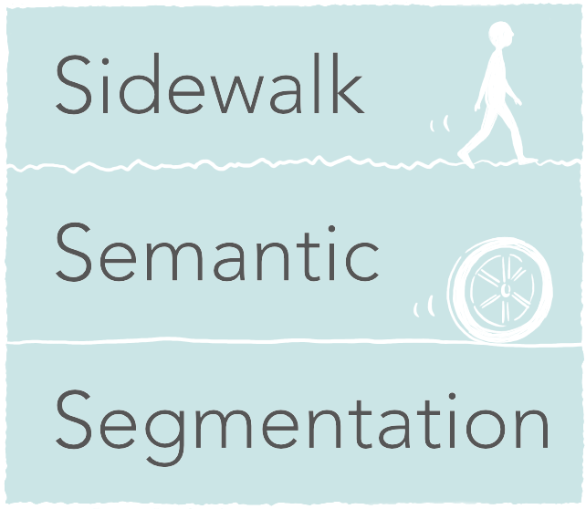

# Sidewalk Semantic Segmentation



[](https://travis-ci.com/mknz/dsr-road-roughness-prediction)

## Live demo

[here](http://sidewalk.online/)

## About

This is the repository of our portfolio project in [DSR](https://www.datascienceretreat.com/). In this project, we built a classifier that can predict the surface category of sidewalks in Berlin from street view images. We built this as a basis for routing application that tells users the road condition.

### Contributors

- [Masanori Kanazu](https://github.com/mknz)
- [Dmitry Yefimenko](https://github.com/Dyefimenko)

## Models

The basis model is [U-Net with VGG11 encoder pretrained with ImageNet](https://github.com/ternaus/TernausNet).

We trained two models, one is a sidewalk detector and the other is a surface category classifier. The two output was combined to make a final prediction.

## Data

We collected 798 images from Google Street View and manually annotated them. We supplemented the dataset with 77 photos that we took ourselves. For the sidewalk detector, we further supplemented the dataset with 1424 images from [Berkeley DeepDrive](https://bdd-data.berkeley.edu/) dataset.

## Results

| Category           | IoU    |
| ------------------ |:-------|
| Sidewalk detection |  0.838 |
| Flat Stones        |  0.547 |
| Pavement Stone     |  0.462 |
| Sett               |  0.602 |
| Bicycle Tiles      |  0.419 |


## Development

### Install dependencies

```
pip3 install -r requirements.txt
```

### Predict an image

#### Download trained weights

```
./donwload_weights.sh
```

#### Run prediction

```
./predict.sh ./tests/resources/segmentation/labelme/JPEGImages/zyZ1BD8DoUJ2.jpg
```

This outputs segmented images to  `./out`

### Train model

```
./train.sh
```

### Run all tests

```
python -m pytest tests
```

### Run interactive tests (This shows some images)

```
python -m pytest tests -m interactive --interactive
```

### See training logs using tensorboard

```
tensorboard --logdir $LOGDIR
```

## License

[MIT](https://raw.githubusercontent.com/mknz/dsr-road-roughness-prediction/master/LICENSE)
